# Available Widgets

## Standard types

### Text

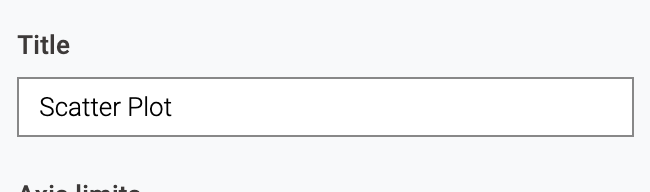

### Number

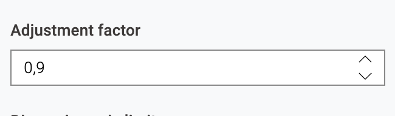

### Checkbox

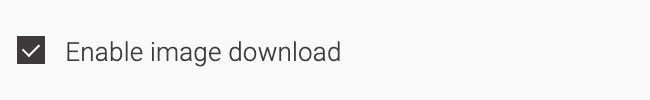

## Single selection

### Dropdown

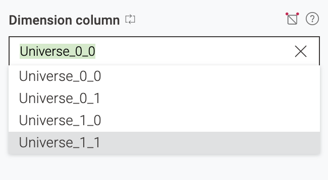

### Value Switch

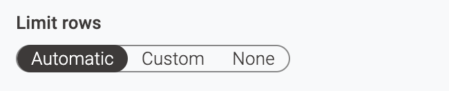

### Radio Buttons

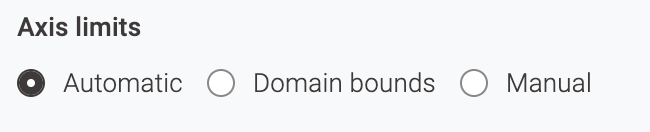

## Multiple Selection

## ComboBox

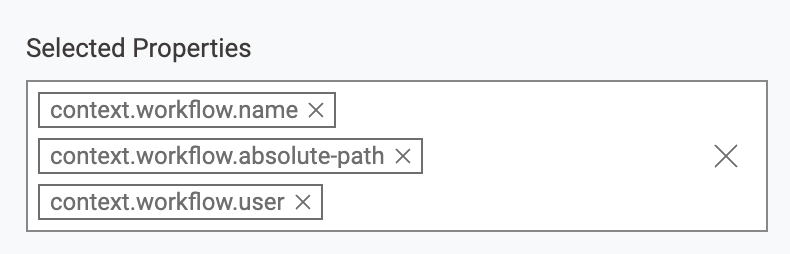

### Twin List

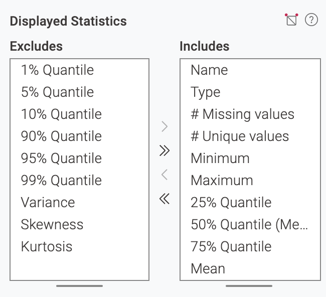

### Column Filter

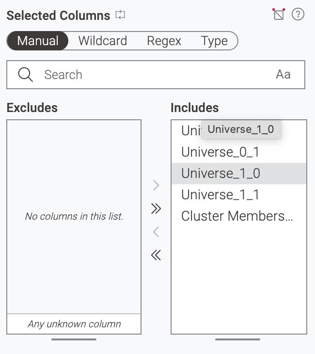

## Credentials

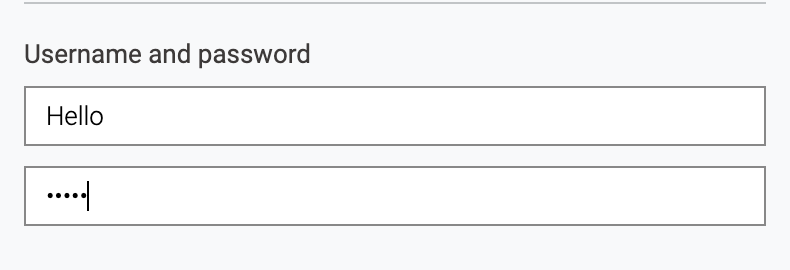

## File Chooser

### Single File Chooser

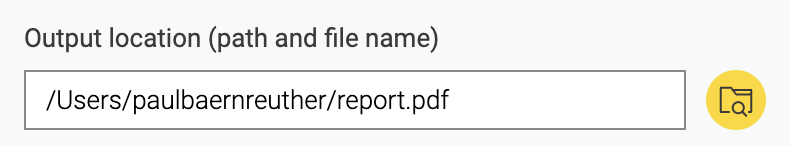

### Multi File Chooser

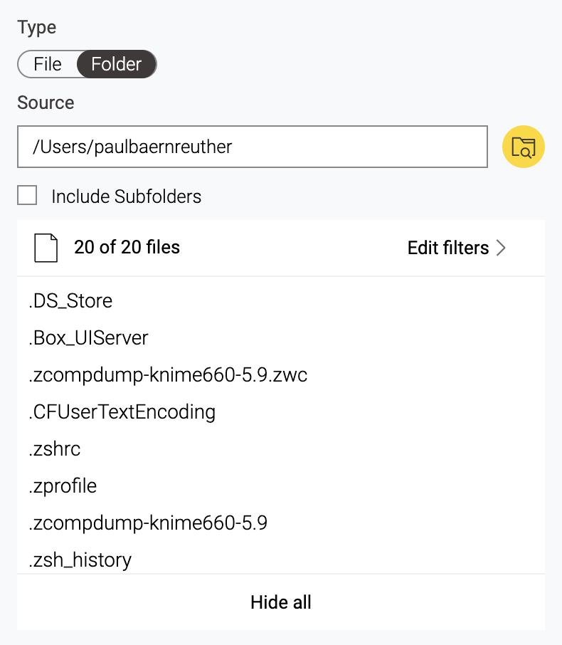

## Date & Time

### Date

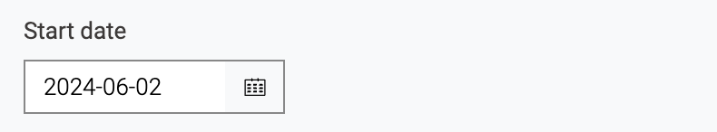

### Time

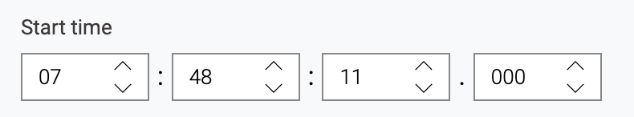

### DateTime

### ZonedDateTime

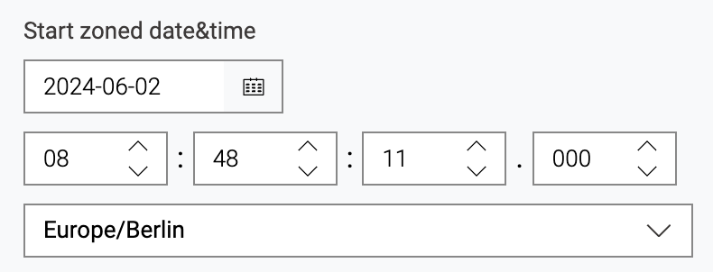

### Time Interval

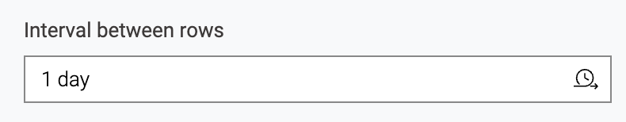

## Text Message

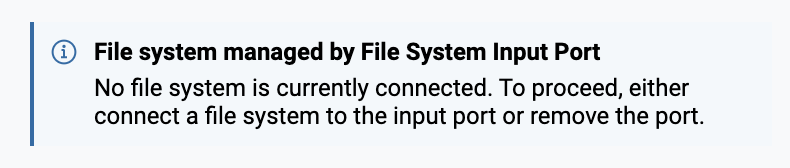

## Button

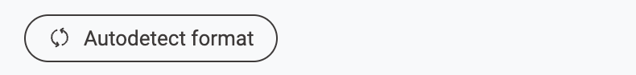

# Layouts

## Section

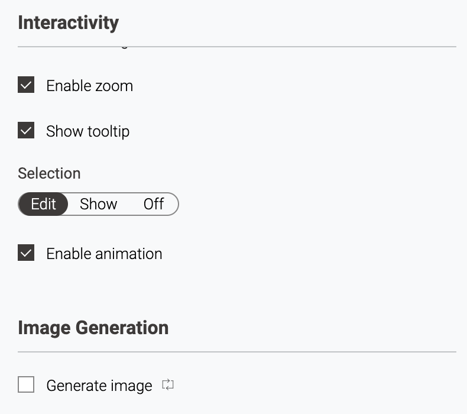

### With Sub Panel

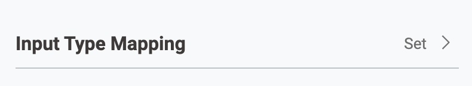

## Horizontal Layout

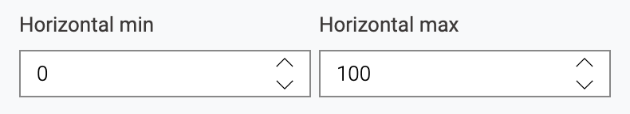

## Array Layout

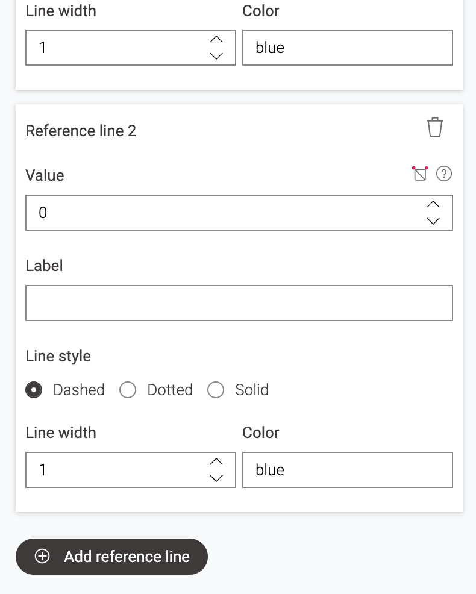

### Compact Array Layout

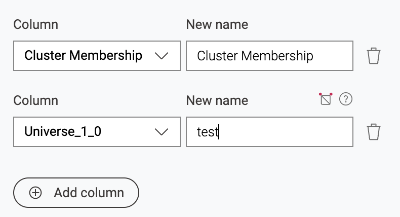
